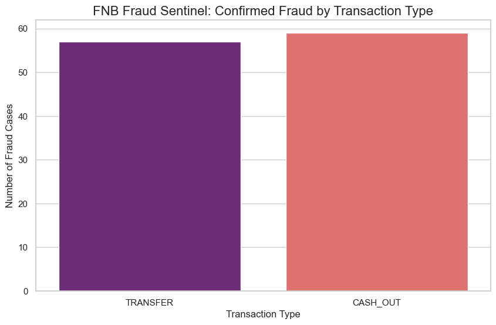

# Fraud Sentinel Pipeline 🇿🇦

A high-performance ETL pipeline designed to ingest, clean, and analyze banking transaction data for fraudulent activity.

## 🚀 Project Overview
This project simulates a banking data environment where raw transaction logs are processed through a multi-stage pipeline to identify high-risk transfers and protect customer assets.

## 🛠️ Tech Stack
- **Python**: Core logic and ETL processing.
- **Pandas**: Data manipulation and Star Schema architecture.
- **Git/GitHub**: Version control and CI/CD readiness.
- **SHA-256 Hashing**: POPIA-compliant PII masking.

## 🏗️ Data Architecture (Medallion Layers)
- **Bronze**: Raw `transactions.csv` (unprocessed logs).
- **Silver**: `cleaned_transactions.csv` (PII masked, integrity checks applied).
- **Gold**: `dim_customers.csv` & `fact_transactions.csv` (Optimized Star Schema).

## 🕵️ Fraud Detection Stats (Sample: 100k records)
- **Confirmed Fraud Cases**: 116
- **High-Value Alerts**: 26,448
- **Alert System**: Suspicious transactions are exported to `fraud_alerts.csv` for forensic review.
### 📈 Visual Insight

